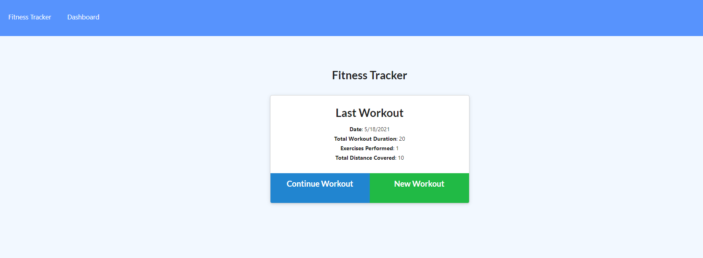
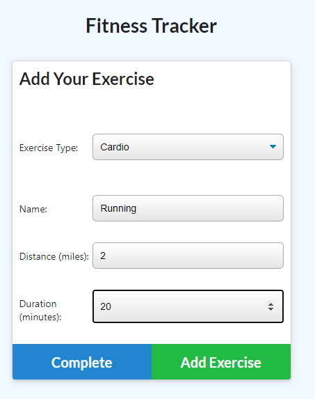
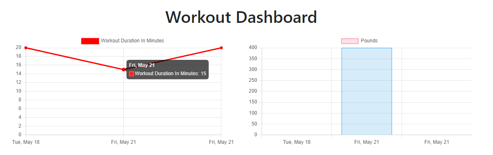

# Workout Tracker

## Links:

Deployed Application: https://agile-waters-85580.herokuapp.com/  
Repository: https://github.com/mbussert/workout-tracker

## Description:

An app to view create and track daily workouts. A user can log multiple exercises in a workout on a given day and also track the name, type, weight, sets, reps, and duration of exercise.

## Table of Contents:

- [Installation](#installation)
- [Usage](#usage)
- [License](#license)
- [Contributing](#contributing)
- [Testing](#tests)
- [Contact](#contact)

## Installation:

A user navigates to the deployed application URL and creates a new workout by adding various exercises.

## Usage:

A user creates a new workout or continues an already existing workout by adding an exercise. All workouts are tracked and displayed on the user dashboard.

## License:

This application is covered under the MIT License.

## Contributing:

Users are free to contribute to this project.

## Tests:

No tests have been created for this application.

## Questions:

GitHub: [mbussert](https://github.com/mbussert)  
 By Email: [mbussert@gmail.com](mailto:mbussert@gmail.com)
